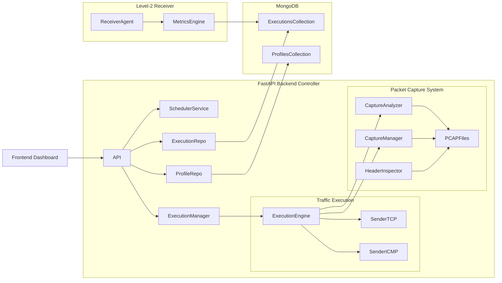
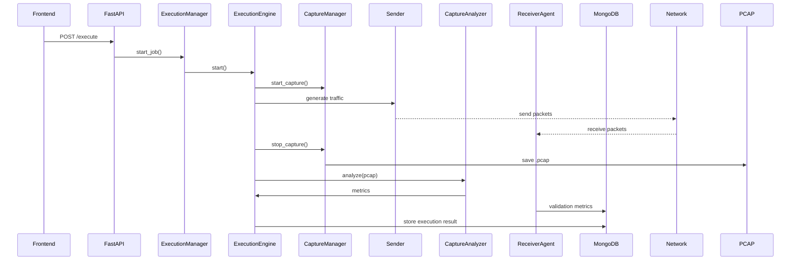
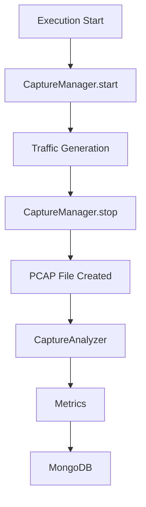

# Adaptive Network Traffic Generator (ATG)

A modular network testing platform designed to generate controlled traffic, capture packets, analyze network behavior, and evaluate system performance.

This system was developed as part of a cybersecurity and networking research initiative focused on traffic validation, execution control, and end-to-end network verification.

---

# Table of Contents

- Overview  
- System Architecture  
- Execution Workflow  
- Packet Capture Pipeline  
- Features  
- Project Structure  
- Technologies Used  
- Hardware Requirements  
- Software Requirements  
- Setup Instructions  
- Running the Application  
- API Reference  
- Authors & Contributors  

---

# Overview

The Adaptive Network Traffic Generator (ATG) enables structured traffic simulation and validation across multiple protocols using a modular and extensible architecture.

The system not only generates traffic but also verifies delivery using a dual validation approach, combining packet capture analysis with receiver-side validation (Level-2 architecture).

The platform provides the following capabilities:

- Protocol-based traffic generation  
- Execution-synchronized packet capture  
- PCAP-based traffic analysis  
- End-to-end packet validation using receiver agents  
- Execution control and scheduling  
- Metrics generation and storage  
- Header-level packet inspection for debugging  

---

# System Architecture

## Level-1 (Sender + Capture Model)


---

## Level-2 (Receiver Validation Model – Implemented)


---

## Backend Architecture



---

# Execution Workflow



---

# Packet Capture Pipeline



---

# Features

## Traffic Generation
- Supports ICMP, HTTP, HTTPS, SSH  
- Configurable packet count, size, duration, and rate  

---

## Packet Capture
- Real-time packet sniffing using Scapy  
- Automatic PCAP generation  
- Capture triggered during execution lifecycle  
- Destination-based filtering  

---

## Receiver Validation (Level-2)
- End-to-end packet verification  
- Latency tracking  
- Duplicate packet detection  
- Sequence validation  
- Corruption detection  

---

## Packet Analysis
- Packet count verification  
- Byte-level analysis  
- Protocol breakdown  
- Delivery percentage calculation  

---

## Header Inspection
- Protocol distribution  
- TCP flag statistics  
- ICMP type distribution  
- Packet size statistics  

---

## Execution Control
- Start  
- Pause  
- Resume  
- Stop  

---

## Scheduling
- One-time execution  
- Interval-based execution  

---

## Persistent Storage
MongoDB stores:

- Traffic profiles  
- Execution history  
- Metrics  
- PCAP file references  

---

# Project Structure

```
backend/

├── level0/
│   ├── cli.py
│   ├── execution_engine.py
│   ├── job_state.py
│   ├── main.py
│   ├── receiver_manager.py
│   ├── run_receiver.py
│   ├── scheduler_service.py
│   ├── test_receiver.py
│   ├── __init__.py
│   │
│   ├── receivers/
│   │   ├── tcp_receiver.py
│   │   └── __init__.py
│   │
│   └── senders/
│       ├── packet_sender.py
│       └── __init__.py
│
├── level1_backend/
│   ├── api.py
│   ├── db_init.py
│   ├── execution_manager.py
│   ├── models.py
│   ├── __init__.py
│   │
│   ├── capture/
│   │   ├── capture_analyzer.py
│   │   ├── capture_manager.py
│   │   ├── capture_repository.py
│   │   ├── capture_utils.py
│   │   ├── header_inspector.py
│   │   └── __init__.py
│   │
│   ├── scheduler/
│   │   ├── scheduler_service.py
│   │   └── __init__.py
│   │
│   └── storage/
│       ├── execution_repository.py
│       ├── mongo.py
│       ├── profile_repository.py
│       ├── scheduler_repository.py
│       └── __init__.py
│
├── level2/
│   ├── destination_agent.py
│   ├── level2_sender.py
│   ├── main_controller.py
│   ├── malicious_profiles.py
│   ├── rfc2544_engine.py
│   └── __init__.py
```

---

# Technologies Used

## Backend
- Python  
- FastAPI  
- Scapy  

## Frontend
- Web dashboard interface  

## Database
- MongoDB  

## Packet Analysis
- PCAP-based traffic inspection  

---

# Hardware Requirements

## Minimum
- Dual-core CPU  
- 4 GB RAM (8 GB recommended)  

## Recommended
- Quad-core CPU  
- 8–16 GB RAM  
- Ethernet connection  

---

# Software Requirements

- Python 3.10+  
- Node.js 18+  
- MongoDB  
- Npcap (Windows) / libpcap (Linux)  

---

# Setup Instructions

```
pip install fastapi uvicorn scapy pymongo dnspython
```

```
python -m uvicorn backend.api:app
```

---

# Running the Application

## Backend API (Swagger UI)
```
http://localhost:8000/docs
```

## Frontend Dashboard
```
http://localhost:3000
```

---

# API Reference

## Health
```
GET /health
```

## Profile Management
```
POST /profiles
GET /profiles
GET /profiles/{profile_name}
```

## Execution
```
POST /execute
GET /jobs
GET /executions
GET /executions/{job_id}
```

## Packet Capture
```
GET /executions/{job_id}/pcap
```

## Header Inspection
```
GET /executions/{job_id}/headers
```

## Execution Control
```
POST /pause/{job_id}
POST /resume/{job_id}
POST /stop/{job_id}
```

## Scheduler
```
POST /schedule/once
POST /schedule/interval
GET /scheduled-jobs
```

---

© Copyright 2026 PES University.

---

## Authors:

Anikait Nair - anikaitm752@gmail.com  
Dr. Swetha P - swethap@pes.edu  
Dr. Prasad B Honnahalli - prasadbh@pes.edu  

---

## Contributors:

PurpleSynapz - info@purplesynapz.com  

---

Licensed under the Apache License, Version 2.0 (the "License");  
You may not use this file except in compliance with the License.  
You may obtain a copy of the License at:  
http://www.apache.org/licenses/LICENSE-2.0  

SPDX-License-Identifier: Apache-2.0  

---

For further queries related to the project/application, reach out to ISFCR, PES University - office.isfcr@pes.edu
