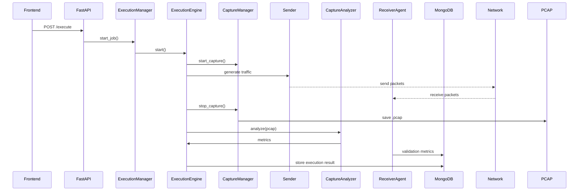

# Adaptive Network Traffic Generator (ATG)

A modular network testing platform designed to generate controlled traffic, capture packets, analyze network behavior, and evaluate system performance.

This system was developed as part of a cybersecurity and networking research initiative focused on traffic validation, execution control, and end-to-end network verification.

---

## Overview

The Adaptive Network Traffic Generator (ATG) enables structured traffic simulation and validation across multiple protocols using a modular and extensible architecture.

The system not only generates traffic but also verifies delivery using a dual validation approach, combining packet capture analysis with receiver-side validation (Level-2 architecture).

### Key Capabilities

* Protocol-based traffic generation
* Execution-synchronized packet capture
* PCAP-based traffic analysis
* End-to-end packet validation using receiver agents
* Execution control and scheduling
* Metrics generation and storage
* Header-level packet inspection

---

## System Architecture

### Level-1 (Sender + Capture Model)


### Level-2 (Receiver Validation Model – Implemented)


---

## Execution Workflow



---

## Features

### Traffic Generation

* Supports ICMP, HTTP, HTTPS, SSH
* Configurable packet count, size, duration, and rate

### Packet Capture

* Real-time packet sniffing using Scapy
* Automatic PCAP generation
* Lifecycle-based capture control

### Receiver Validation (Level-2)

* End-to-end packet verification
* Latency tracking
* Duplicate detection
* Sequence validation

### Packet Analysis

* Packet count verification
* Protocol breakdown
* Delivery percentage

### Execution Control

* Start / Pause / Resume / Stop

### Scheduling

* One-time and interval-based execution

### Storage

* MongoDB for profiles, executions, and metrics

---

## Project Structure

```
backend/
├── level0/
├── level1_backend/
├── level2/
```

---

## Technologies Used

* Python
* FastAPI
* Scapy
* MongoDB

---

## Setup

```bash
pip install fastapi uvicorn scapy pymongo dnspython
```

```bash
python -m uvicorn backend.api:app
```

---

## Running

* Backend: http://localhost:8000/docs
* Frontend: http://localhost:3000

---

## Authors

* Anikait Nair
* Dr. Swetha P
* Dr. Prasad B Honnavalli

---

## License

Licensed under Apache License 2.0
