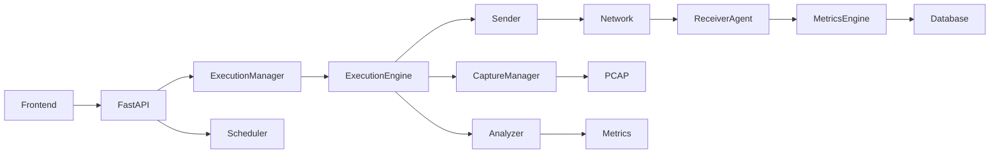
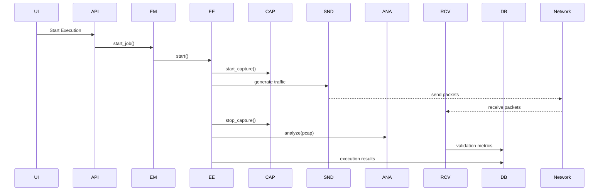

# ADAPTIVE NETWORK TRAFFIC GENERATOR (ATG)

A network traffic generation and validation platform designed to simulate real-world traffic, perform packet capture, validate delivery, and analyze network performance through an integrated pipeline.

This system was developed as part of a cybersecurity research and engineering initiative focused on **traffic validation, execution orchestration, and end-to-end network behavior analysis**.

---

# Table of Contents

- Overview
- System Architecture
- Execution Workflow
- Project Structure
- Features
- Execution Pipeline
- Technologies Used
- Hardware Requirements
- Installation Instructions
- Running the Application
- API Reference
- Validation & Analysis Pipeline
- Contributing
- Code of Conduct
- Security Policy
- Community & Support

---

# Overview

The Adaptive Network Traffic Generator (ATG) enables developers, researchers, and network engineers to simulate controlled network traffic and validate delivery using both capture-based and receiver-based mechanisms.

The system integrates traffic generation, packet capture, receiver-side validation, and analysis into a unified workflow.

The platform provides the following capabilities:

- Protocol-based traffic generation (ICMP, TCP, HTTP, HTTPS, SSH)
- Execution lifecycle-controlled packet capture
- PCAP-based traffic analysis
- Receiver-side validation for accurate delivery verification
- Duplicate, sequence, and latency tracking
- Execution control and scheduling
- Modular architecture across multiple levels (Level-0, Level-1, Level-2)
- API-driven execution and monitoring
- Persistent storage of execution results and metrics

---

# System Architecture

## Level-1 (Sender + Capture Model)


---

## Level-2 (Receiver Validation Model – Implemented)


---

## Backend Architecture



---

# Execution Workflow



---

# Project Structure

```
backend/

├── level0/
├── level1_backend/
├── level2/
```

---

# Features

### Traffic Generation
- Supports ICMP, HTTP, HTTPS, SSH
- Configurable traffic parameters

### Packet Capture
- Real-time capture using Scapy
- Execution-synchronized capture lifecycle

### Receiver Validation
- Latency tracking
- Duplicate detection
- Sequence validation
- Packet integrity verification

### Packet Analysis
- Protocol distribution
- Delivery percentage
- PCAP-based inspection

### Execution Control
- Start / Pause / Resume / Stop

### Scheduling
- One-time and interval execution

### Storage
- MongoDB-based persistence

---

# Execution Pipeline

1. Execution request initiated via API  
2. ExecutionManager schedules job  
3. ExecutionEngine starts traffic generation  
4. CaptureManager starts packet capture  
5. Traffic flows through network  
6. ReceiverAgent validates packets  
7. Capture stops and PCAP is analyzed  
8. Metrics stored in database  

---

# Technologies Used

### Backend
- Python
- FastAPI
- Scapy

### Frontend
- React

### Database
- MongoDB

---

# Hardware Requirements

### Minimum
- Dual Core CPU  
- 4 GB RAM  

### Recommended
- Quad Core CPU  
- 8–16 GB RAM  

---

# Installation Instructions

```
git clone https://github.com/ANair97/Adaptive-Network-Traffic-Generator.git
cd Adaptive-Network-Traffic-Generator
```

---

## Backend
### windows 
```
cd /Users/lapac/Documents/projects/Adaptive-Network-Traffic-Generator
python3.12 -m venv .venv
source .venv/bin/activate
pip install -r requirements.txt

set ATG_MONGO_URI=mongodb://localhost:27017
set ATG_DB_NAME=atg_v1

<!-- run as Administrator -->
uvicorn level1_backend.api:app --host 0.0.0.0 --port 8000 --reload
```
### mac / Linux 

```
cd /Users/lapac/Documents/projects/Adaptive-Network-Traffic-Generator
python3.12 -m venv .venv
source .venv/bin/activate
pip install -r requirements.txt

export ATG_MONGO_URI="mongodb://localhost:27017"
export ATG_DB_NAME="atg_v1"

sudo -E .venv/bin/uvicorn level1_backend.api:app --host 0.0.0.0 --port 8000 --reload
```
If you are on macOS and do not need ICMP traffic or packet capture, you can omit `sudo -E` and run `uvicorn` directly. ICMP and Scapy capture require elevated privileges on macOS.

---

## Frontend

```
cd frontend/traffic-orchestrator-main
npm install
npm run dev
```

---

# Running the Application

### Backend
```
http://localhost:8000/docs
```

### Frontend
```
http://localhost:8080 
<!-- check PORT NO IN vite.config.ts /other than  that it doesnt work regarless of the port no in ur cmd -->
```

---

# API Reference

### Execution
- `POST /execute`
- `GET /executions`
- `GET /executions/{job_id}`

### Control
- `POST /pause/{job_id}`
- `POST /resume/{job_id}`
- `POST /stop/{job_id}`

### Analysis
- `GET /executions/{job_id}/pcap`
- `GET /executions/{job_id}/headers`

### Scheduling
- `POST /schedule/once`
- `POST /schedule/interval`

---

# Validation & Analysis Pipeline

1. Traffic generation  
2. Packet capture  
3. Network transmission  
4. Receiver validation  
5. PCAP analysis  
6. Metrics computation  
7. Data storage  

---

# Contributing

Please refer to `CONTRIBUTING.md` before submitting changes.

---

# Code of Conduct

All contributors are expected to maintain a respectful and professional environment.

---

# Security Policy

Report vulnerabilities privately. Do not open public issues for security concerns.

---

# Community & Support

| Channel | Purpose |
|---|---|
| [GitHub Issues](https://github.com/ANair97/Adaptive-Network-Traffic-Generator/issues) | Bug reports & feature requests |
| [GitHub Discussions](https://github.com/ANair97/Adaptive-Network-Traffic-Generator/discussions) | General questions, ideas, and community chat |
| **Email** — office.isfcr@pes.edu | Academic & research collaboration inquiries |
| **Email** — anikaitm752@gmail.com | Direct maintainer contact |

> **Note:** This project is developed and maintained as part of cybersecurity research at PES University (ISFCR). Response times may vary during academic periods.

---

# © Copyright 2026 PES University.

## Authors:
 ###### Anikait Nair - anikaitm752@gmail.com
 ###### Dr. Swetha P - swethap@pes.edu
 ###### Dr. Prasad B Honnahalli - prasadbh@pes.edu

## Contributors:
 ###### ISFCR - office.isfcr@pes.edu

 Licensed under the Apache License, Version 2.0 (the "License"); 
 You may not use this file except in compliance with the License.
 You may obtain a copy of the License at http://www.apache.org/licenses/LICENSE-2.0
 ###### SPDX-License-Identifier: Apache-2.0

---

For further queries related to the project/application, reach out to ISFCR, PES University - office.isfcr@pes.edu
