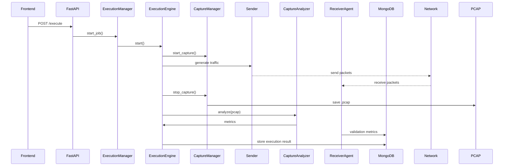
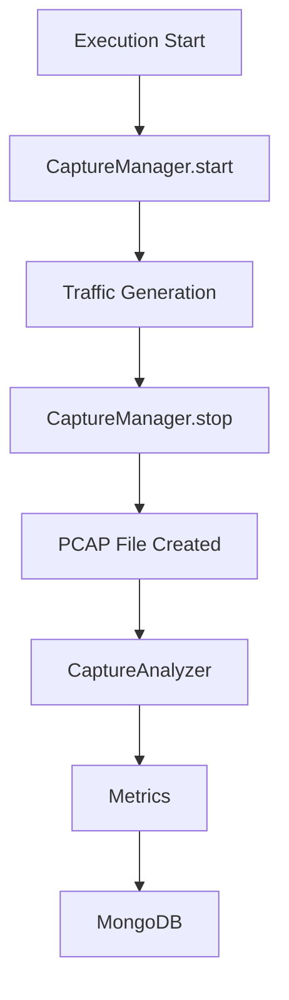

# Adaptive Network Traffic Generator (ATG)

A modular network testing platform designed to generate controlled traffic, capture packets, analyze network behavior, and evaluate system performance.

The Adaptive Traffic Generator enables structured traffic simulations using multiple protocols while verifying delivery using packet capture and **receiver-side validation (Level-2 architecture)**.

---

# Overview

ATG provides a flexible framework to:

- Generate protocol-based traffic
- Capture packets during execution
- Analyze captured traffic
- Verify sent vs received packets
- Perform **end-to-end validation using receiver agents**
- Schedule traffic executions
- Store execution results and metrics
- Inspect packet headers for debugging

The system follows a **modular architecture** allowing components to evolve independently.

---

# System Architecture

## Level-1 (Sender + Capture Model)


---

## Level-2 (Receiver Validation Model – Implemented)


---


---

# Execution Workflow



---

# Packet Capture Pipeline



---

# Features

## Traffic Generation

Supported protocols:

- ICMP
- HTTP
- HTTPS
- SSH

Configurable parameters:

- Packet count
- Packet size
- Duration based traffic
- Packets per second rate

---

## Packet Capture

- Real-time packet sniffing using **Scapy**
- Automatic **PCAP generation**
- Destination based filtering
- Capture triggered during execution

---

## Receiver Validation (Level-2)

- End-to-end packet verification
- Latency tracking
- Duplicate detection
- Sequence validation
- Corruption detection

---

## Packet Analysis

CaptureAnalyzer performs:

- Packet count verification
- Byte analysis
- Protocol breakdown
- Delivery percentage calculation

---

## Header Inspection

HeaderInspector extracts:

- Protocol distribution
- TCP flag statistics
- ICMP type distribution
- Packet size statistics

---

## Execution Control

Traffic executions support:

- Start
- Pause
- Resume
- Stop

---

## Scheduling

Scheduler supports:

- One-time execution
- Interval based execution

---

## Persistent Storage

MongoDB stores:

- Traffic profiles
- Execution history
- Metrics
- PCAP file references

---

# Project Structure

```
adaptive-traffic-generator/

├── core/
│   ├── execution_engine.py
│   ├── job_state.py
│   └── senders/
│       ├── icmp_sender.py
│       └── tcp_sender.py
│
├── backend/
│   ├── api.py
│   ├── execution_manager.py
│   ├── scheduler_service.py
│   ├── capture/
│   │   ├── capture_manager.py
│   │   ├── capture_analyzer.py
│   │   └── header_inspector.py
│   └── storage/
│       ├── mongo.py
│       ├── profile_repository.py
│       └── execution_repository.py
│
├── receiver/
│   ├── receiver_server.py
│   ├── packet_validator.py
│   ├── latency_tracker.py
│   └── metrics_engine.py
│
├── frontend/
├── pcap_files/
├── docs/
├── tests/
└── README.md
```

---

# Technology Stack

Backend

- Python
- FastAPI
- Scapy

Frontend

- Web dashboard interface

Database

- MongoDB

Packet Analysis

- PCAP based traffic inspection

---

# API Endpoints

### Health
```
GET /health
```

### Profile Management
```
POST /profiles
GET /profiles
GET /profiles/{profile_name}
```

### Execution
```
POST /execute
GET /jobs
GET /executions
GET /executions/{job_id}
```

### Packet Capture
```
GET /executions/{job_id}/pcap
```

### Header Inspection
```
GET /executions/{job_id}/headers
```

### Execution Control
```
POST /pause/{job_id}
POST /resume/{job_id}
POST /stop/{job_id}
```

### Scheduler
```
POST /schedule/once
POST /schedule/interval
GET /scheduled-jobs
```

---

# Hardware Requirements

## Minimum
- Dual-core CPU
- 4 GB RAM (8 GB recommended)

## Recommended
- Quad-core CPU
- 8–16 GB RAM
- Ethernet connection

---

# Software Requirements

- Python 3.10+
- Node.js 18+
- MongoDB
- Npcap (Windows) / libpcap (Linux)

---

# Setup Instructions

```
pip install fastapi uvicorn scapy pymongo dnspython
```

```
python -m uvicorn backend.api:app
```

---

# Current Implementation Status

- Traffic generation engine
- Execution manager
- Packet capture system
- Packet analysis
- Header inspection
- Scheduler
- MongoDB integration
- PCAP export
- Level-2 receiver validation

---

# License

MIT License

---

# Disclaimer

This tool is intended only for:

- Educational use
- Research
- Authorized network testing

Do not use without permission.
